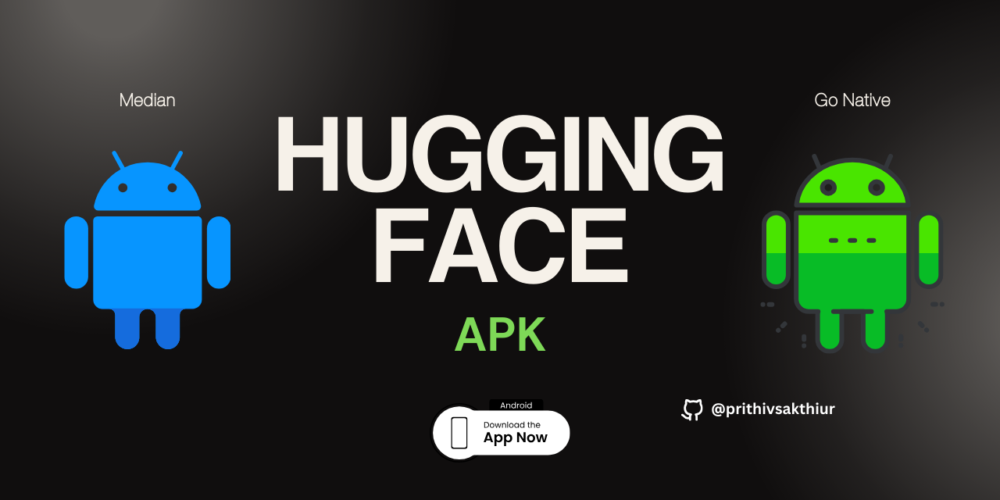
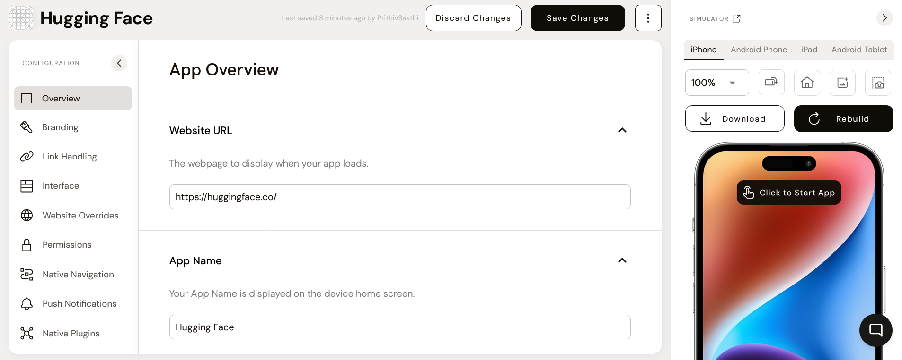
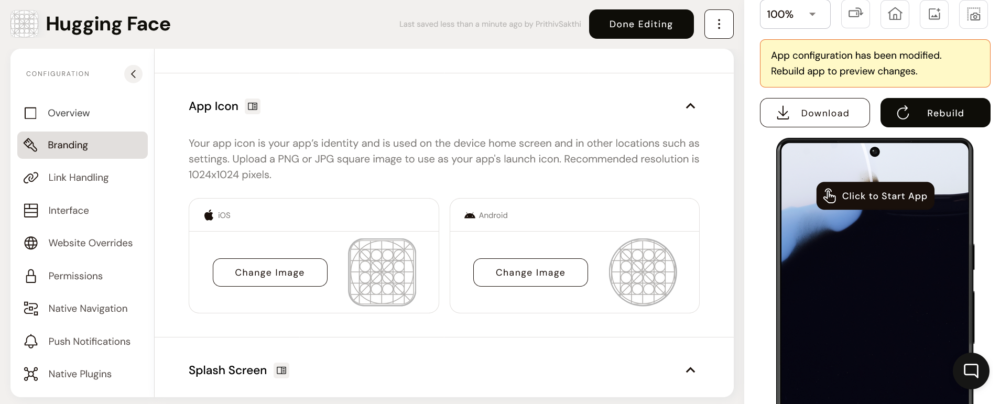
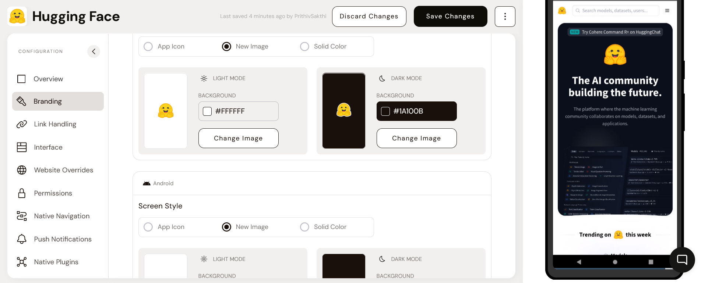
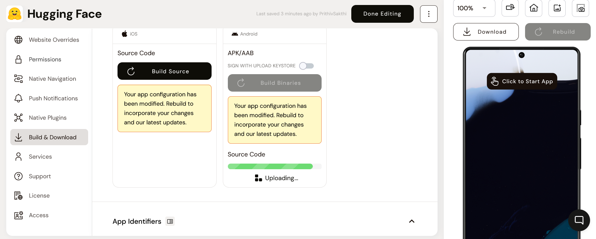
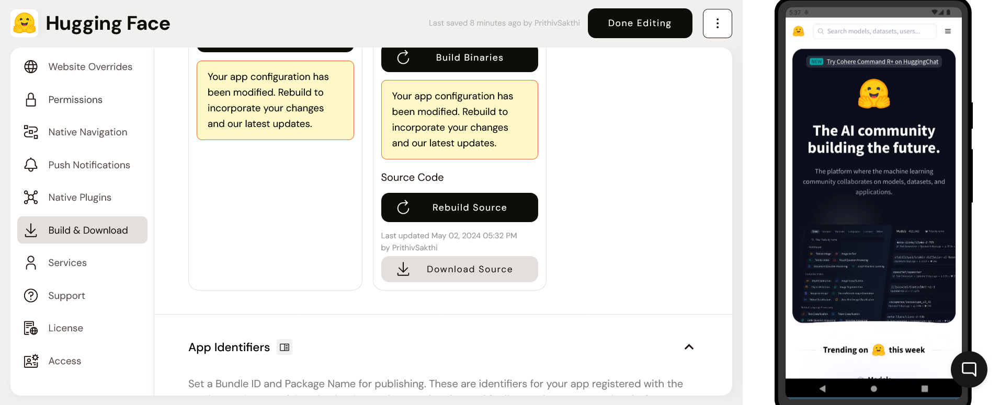
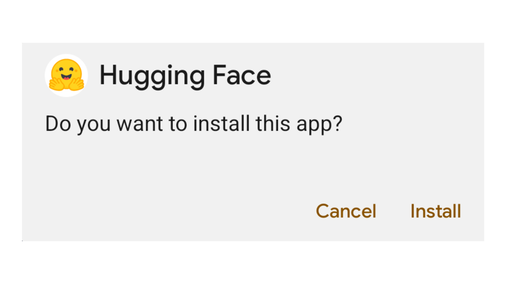
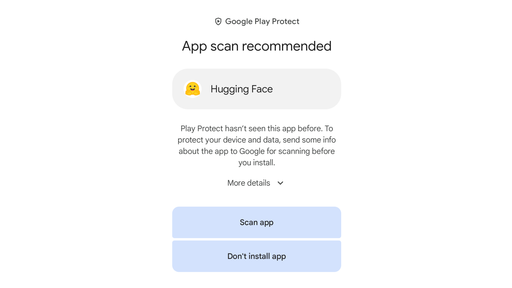
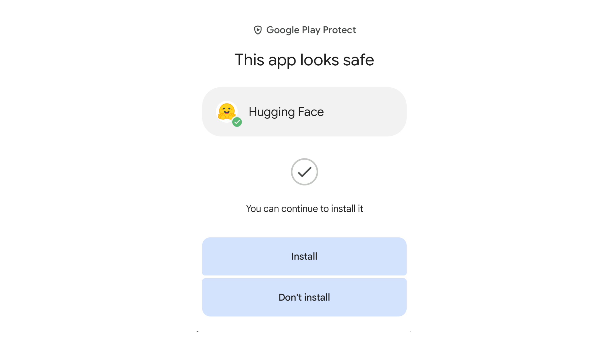

  <b style="color:red;">HUGGINGFACE ANDROID APPLICATION DOWNLOAD ⬇️</b>

  <b style="color:red;">ABOUT 🗞️</b>

🚀This app is built for experimental purposes only and has been verified by Play Protect.

🚀The app was created using Go Native, which combines enterprise-grade web and native app development. It functions by pasting URLs to build the framework of the entire APK.

🥤You can download the APK from the following link: **https://drive.google.com/file/d/11Qf0sL2tkWQYUvrtWU5Mr1LGnjlU-tV_/view?usp=sharing**

🥤To build with the SDK, the plugins, and the source code for the app, please refer to the android_source.tar file: **https://drive.google.com/drive/folders/1A1sNHXYyoS8ur6aSPH3BcbS4LTvm51v7?usp=sharing**

  <b style="color:red;">START🧵</b>

🚀On the GoNative web page (https://median.co), head to "Median". Create a new project and add the URL that is to be converted into an APK. Then, provide the app name. Finally, save changes to the stage!

🚀After completing the Overview stage, proceed to the Branding stage. Your app icon serves as your app’s identity and is utilized on the device home screen and in other locations, such as settings. Upload a PNG or JPG square image to be used as your app's launch icon. The recommended resolution is 1024x1024 pixels.

🚀Configure the splash screen that displays while your app initially launches. Splash screen appearance varies between iOS and Android to meet design guidelines for each platform. The splash screen will display until your webpage finishes loading (when the DOMContentLoaded event fires) so that the transition between splash screen and your app is seamless.

🚀After making changes to your app configuration press "Rebuild" to rebuild your app files for download. To test your iOS app on a physical device build from source using Xcode, an Apple Developer account is required. Your Android app may be built locally using our included Gradle script or using Android Studio. Set a Bundle ID and Package Name for publishing. These are identifiers for your app registered with the Apple App Store and Google Play Store. They can be changed for licensed apps at any time before your app is published.

🚀To debug JavaScript in your web content from our browser-based simulators first rebuild your app with Web Console Logs enabled. Then, on the simulator panel toggle toggle "Debug Mode" and click "Appetize". The JavaScript console for the app will be shown at the bottom of the window that opens. The "Debug Logs" tab will show the native app log output as well as the web console logs. Note: This option builds an unsigned debug build and must be disabled to build a signed APK/AAB for the Google Play Store.

⬇️After obtaining the information, return to the top and open the Google Drive link to download the app. Then, "install" it.

⬇️Then it verifies the app to ensure it's safe. After verification, it proceeds to the following steps.

⬇️After the app is deemed safe, you can install it by clicking the "Install" button. That's it! You can now use your own Hugging Face login.

⬇️You can also build the app with the GoNative plugins (Median). You can find the link at the top of the list.

## 💰 Buy me a coffee 🥤
   

Check out the configuration reference at https://huggingface.co/docs/hub/spaces-config-reference
